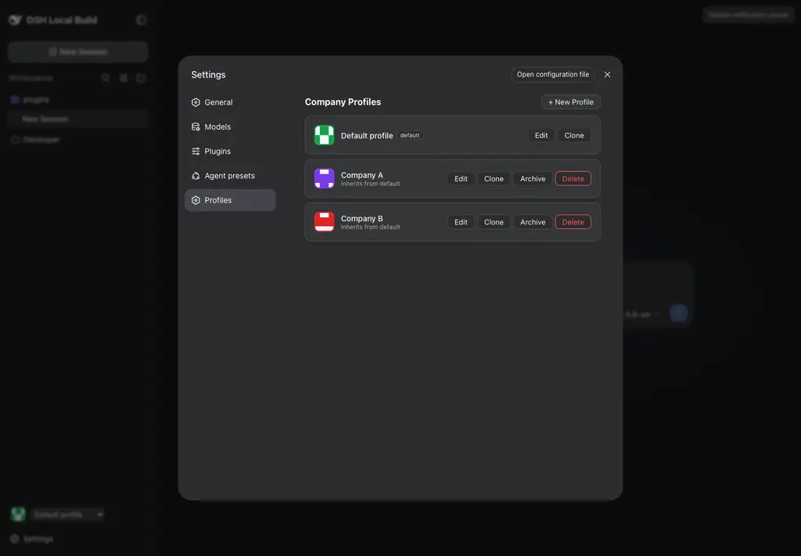

# dsh-profile-plugin

[](./LICENSE)
[](https://nodejs.org)

Durable company profile management for [DeepSeek Harness](https://github.com/deepseek-ai/deepseek-harness). Provides persistent multi-tenant profile isolation with capability inheritance, OAuth credential vaulting, session attention tracking, and tool-policy enforcement — all as a single Cordis 4 plugin row.

## Table of Contents

- [Overview](#overview)
- [Architecture](#architecture)
- [Security Model](#security-model)
- [Installation](#installation)
- [Configuration](#configuration)
- [OAuth Setup](#oauth-setup)
- [Usage](#usage)
- [Screenshots](#screenshots)
- [Troubleshooting](#troubleshooting)
- [Development](#development)
- [Compatibility](#compatibility)
- [Contributing](#contributing)
- [Release](#release)
- [License](#license)

## Overview

Company Profiles turns a single DeepSeek Harness installation into a multi-company workspace. Each profile owns its own:

- **Display identity** — name, color, avatar, legal entity
- **MCP capability set** — inherited from a default profile with local enable/disable overrides
- **OAuth credentials** — PKCE-secured, profile-scoped, with state expiry and single-flight token refresh
- **Session attention** — aggregated approval, question, and error indicators per profile
- **Tool admission** — immutable per-generation capability snapshots that gate every tool execution

Profiles persist to a standalone JSON file outside the Harness installation directory, so Harness upgrades never overwrite profile data.

## Architecture

```
┌─────────────────────────────────────────────────────────────┐
│  Host (Node.js)                                             │
│                                                             │
│  ┌──────────────┐   ┌────────────┐   ┌──────────────────┐  │
│  │   Registry    │   │ OAuthVault │   │ ProfileAttention │  │
│  │ (atomic JSON) │   │ (credential│   │  (session event  │  │
│  │  CAS writes)  │   │  provider) │   │   aggregation)   │  │
│  └──────┬───────┘   └─────┬──────┘   └────────┬─────────┘  │
│         │                 │                    │            │
│  ┌──────┴─────────────────┴────────────────────┴─────────┐  │
│  │              Host Runtime & API Routes                 │  │
│  │  • Tool pre-execute / execute admission (generations)  │  │
│  │  • Same-origin JSON API (/company-profiles/api)        │  │
│  │  • OAuth callback route (/company-profiles/oauth/…)    │  │
│  └────────────────────────────────────────────────────────┘  │
│                                                             │
├─────────────────────────────────────────────────────────────┤
│  Client (Browser)                                           │
│                                                             │
│  ┌──────────────────┐  ┌─────────────────────┐              │
│  │ ProfileSwitcher  │  │ ProfilesSettings    │              │
│  │  (select widget) │  │ (settings panel)    │              │
│  └──────────────────┘  └─────────────────────┘              │
└─────────────────────────────────────────────────────────────┘
```

### Module Map

| Module | Export | Purpose |
|--------|--------|---------|
| `index` | `apply(ctx)` | Cordis plugin entry; wires registry, OAuth vault, attention, runtime, and routes |
| `model` | Types, validation, resolution | Profile/capability data model with deterministic avatar/color defaults |
| `registry` | `CompanyProfileRegistry` | Atomic JSON registry with optimistic CAS revision, subscriptions |
| `oauth` | `OAuthVault` | Profile-scoped OAuth state, PKCE, token/client credential persistence |
| `runtime` | `ProfileRuntime` | Immutable capability generations with lease-based tool admission |
| `host-runtime` | `installHostRuntime()` | Cordis event hooks for `tools/pre-execute` and `tools/execute` |
| `host-api` | `registerHostRoutes()` | Same-origin JSON Host API and OAuth callback HTTP handler |
| `attention` | `ProfileAttention` | Session event observer → per-profile attention aggregation |
| `mcp-manager` | `McpManager` | Live MCP connections (stdio/streamable-http), one per profile/server/generation |
| `client` | `ProfileSwitcher`, `ProfilesSettings` | React components for browser UI (no JSX, plain `createElement`) |

## Security Model

### Data Isolation

- Each profile's capabilities are resolved through a **single-parent inheritance chain** from the default profile. Cross-profile capability leakage is structurally prevented: a profile can only inherit from the default root.
- Tool execution is gated by **immutable generation snapshots**. A lease is acquired at pre-execute time and verified again at execute time; stale generations cannot authorize tools.
- Profile data is stored in a **single owner-only JSON file** with atomic writes and file-level locking (`withFileLock` + `writeFileAtomic`).

### OAuth Security

- **PKCE** (Proof Key for Code Exchange) for all OAuth flows.
- **State parameter** hashed with timing-safe comparison; single-use (`callbackClaimed`).
- **TTL-based state expiry** — pending authorizations expire automatically.
- **Revocation generations** — revoking credentials invalidates all existing tokens for that binding.
- Secrets stored through the Harness `CredentialProvider` abstraction, never in plaintext JSON.

### API Surface

- All Host API routes enforce **same-origin checks** (`assertSameOrigin`).
- Request body size capped at **256 KiB** to prevent abuse.
- Optimistic concurrency via **`expectedRevision`** on every mutation — concurrent edits fail predictably with `RevisionConflictError`.

### Compatibility boundary

Profiles require the Harness `ProfileId` compatibility seam carried by this release's companion core branch. The plugin fails closed when authoritative profile identity is unavailable. Model/provider selection remains Harness-global by design; profile colors never alter global theme tokens.

## Installation

### Prerequisites

- [DeepSeek Harness](https://github.com/deepseek-ai/deepseek-harness) installed and running
- Node.js ^22.19.0 or >=24.0.0
- pnpm

### Install the Plugin

```sh
# From a git clone
git clone https://github.com/bloodf/dsh-profile-plugin.git
cd dsh-profile-plugin
pnpm install
pnpm build
pnpm bundle

# Register with Harness
dsh plugin --profile web add /absolute/path/to/dsh-profile-plugin
```

Alternatively, download a release tarball and its `SHA256SUMS` from the [Releases page](https://github.com/bloodf/dsh-profile-plugin/releases), verify the checksum, extract it, then register the extracted directory with `dsh plugin add`:

```sh
sha256sum -c SHA256SUMS
tar xzf dsh-profile-plugin-*.tgz
```

The plugin declares one Host row in `cordis.patch.yml`; the browser half loads automatically through the `dsh.client` package metadata.

### Update

```sh
cd /path/to/dsh-profile-plugin
git pull
pnpm install
pnpm build
pnpm bundle
# Restart Harness to pick up changes
```

### Uninstall

```sh
dsh plugin --profile web remove company-profiles
```

Profile data at `$DSH_HOME/company-profiles/profiles.json` is preserved after uninstall. Remove it manually if no longer needed.

## Configuration

The plugin is configured through `cordis.patch.yml`:

```yaml
- insert:
    - id: company-profiles
      name: 'dsh-profile-plugin'
      config:
        path: !!js dshHomePath('company-profiles/profiles.json')
```

| Key | Type | Description |
|-----|------|-------------|
| `path` | `string` | Absolute path to the profile metadata JSON file. Defaults to `$DSH_HOME/company-profiles/profiles.json`. |

The JSON file is created automatically on first use with a single default profile.

## OAuth Setup

OAuth credentials are scoped per `(profileId, serverId, accountId)` triple.

1. **Register your OAuth application** with the target provider (e.g., GitHub, Google).
2. **Set the callback URL** to `http://localhost:<port>/company-profiles/oauth/callback`.
3. **Store client credentials** through the Harness `CredentialProvider`.
4. **Begin an OAuth flow** via the Host API:

```json
POST /company-profiles/api
{
  "action": "oauth-begin",
  "profileId": "my-company",
  "serverId": "github",
  "accountId": "org-main",
  "issuer": "https://github.com",
  "redirectUrl": "http://localhost:3080/company-profiles/oauth/callback",
  "browserBinding": "<browser-session-id>"
}
```

The vault handles PKCE challenge generation, state parameter creation, timing-safe callback verification, and token persistence automatically.

## Usage

### Programmatic Access

```ts
// In a Cordis plugin with access to ctx
const registry = ctx.companyProfiles

// Read current state
const document = registry.snapshot()

// Resolve a profile (with inherited capabilities)
const resolved = registry.resolve('my-company')

// Create a profile
await registry.create(document.revision, {
  fields: { displayName: 'Acme Corp', website: 'https://acme.example' },
  capabilities: [
    { kind: 'mcp', key: 'github', state: 'enabled', config: { transport: 'stdio', serverName: 'github', command: 'mcp-github' } }
  ]
})

// Subscribe to changes
const unsubscribe = registry.subscribe((doc) => {
  console.log('Profiles updated, revision:', doc.revision)
})
```

### Host API

All mutations go through `POST /company-profiles/api` with a JSON body containing `action` and `expectedRevision`. Available actions:

| Action | Description |
|--------|-------------|
| `create` | Create a new profile |
| `update` | Update profile fields and/or capabilities |
| `archive` | Archive a profile (must have no active sessions) |
| `reorder` | Change profile display order |
| `set-default` | Change the default profile |
| `clone` | Clone an existing profile |
| `oauth-begin` | Start an OAuth authorization flow |
| `oauth-revoke` | Revoke OAuth credentials for a binding |

## Screenshot



Profiles run inside the existing Harness sidebar and Settings shell. Profile color decorates identity controls only; global theme and model selection remain unchanged.

## Troubleshooting

### Plugin fails to load

**Symptom:** Harness reports missing peer dependencies.

**Fix:** Ensure all peer dependencies are satisfied:

```sh
pnpm install
```

This plugin requires Cordis ≥4.0.1, MCP SDK ≥1.29.0, and specific `@deepseek-ai/dsh-*` packages. Check `package.json` `peerDependencies` for exact ranges.

### Revision conflict errors

**Symptom:** `RevisionConflictError: company profiles revision conflict: expected N, actual M`

**Cause:** Two concurrent mutations targeted the same revision. This is intentional optimistic concurrency control.

**Fix:** Re-read the current document, get the latest revision, and retry the operation.

### OAuth callback never completes

**Symptom:** Browser redirects to callback URL but nothing happens.

**Possible causes:**
1. OAuth callback route not installed (requires Host `WebServer` service).
2. State parameter expired (default TTL applies).
3. Browser binding mismatch.

**Fix:** Check Harness logs for OAuth-related errors. Ensure the callback URL matches exactly, including port.

### Profile data file permissions

**Symptom:** `EACCES` errors reading or writing profiles.

**Fix:** The profile JSON file must be readable and writable by the Harness process user. Check ownership and permissions:

```sh
ls -la "$DSH_HOME/company-profiles/profiles.json"
```

### Tool denied for profile

**Symptom:** `tool 'mcp__server__method' is disabled for profile 'xyz'`

**Cause:** The profile does not have an enabled capability for that tool, or the capability generation is stale.

**Fix:** Ensure the MCP capability is enabled in the profile's capabilities array (or inherited from default). Triggering a registry update forces generation reconciliation.

## Development

### Prerequisites

```sh
node --version  # ^22.19.0 or >=24.0.0
pnpm --version  # any recent version
```

### Build

```sh
pnpm build          # TypeScript → lib/
```

### Test

```sh
pnpm test           # Node.js built-in test runner via tsx
```

### Pack

```sh
pnpm pack --pack-destination .   # Creates .tgz for distribution
```

### Project Structure

```
dsh-profile-plugin/
├── src/
│   ├── index.ts          # Plugin entry point
│   ├── model.ts          # Data model, validation, capability resolution
│   ├── registry.ts       # Atomic JSON profile registry
│   ├── oauth.ts          # OAuth vault with PKCE and credential management
│   ├── runtime.ts        # Capability generations and tool admission leasing
│   ├── host-runtime.ts   # Cordis tool-policy event hooks
│   ├── host-api.ts       # HTTP API and OAuth callback routes
│   ├── attention.ts      # Session attention aggregation
│   ├── mcp-manager.ts    # Live MCP connections (stdio + streamable-http)
│   └── client/            # React browser components (client bundle entry)
├── tests/
│   ├── registry.test.ts      # Registry CRUD and concurrency tests
│   ├── oauth.test.ts         # OAuth flow and credential tests
│   ├── capabilities.test.ts  # Capability inheritance and admission tests
│   ├── attention.test.ts     # Session attention aggregation tests
│   ├── host-runtime.test.ts  # Tool-policy admission hook tests
│   └── mcp-manager.test.ts   # MCP manager connection lifecycle tests
├── cordis.patch.yml      # Harness plugin row declaration
├── package.json
└── tsconfig.json
```

### Code Conventions

- Pure ESM (`"type": "module"`)
- Strict TypeScript with `noUncheckedIndexedAccess` and `exactOptionalPropertyTypes`
- JSX for browser components (`.tsx`), plain `React.createElement` at plugin slot-registration boundaries
- Atomic file writes with file-level locking for all persistent state
- Optimistic concurrency (CAS revisions) on every mutation

## Compatibility

| Dependency | Required Version |
|------------|-----------------|
| Node.js | ^22.19.0 \|\| >=24.0.0 |
| Cordis | ^4.0.1 |
| MCP SDK | ^1.29.0 |
| React | ^18.2.0 |
| `@deepseek-ai/dsh-atomic-write` | ^0.1.0-rc.8 |
| `@deepseek-ai/dsh-credentials` | ^0.1.0-rc.8 |
| `@deepseek-ai/dsh-host-webserver` | ^0.1.0-rc.8 |
| `@deepseek-ai/dsh-session` | ^0.1.0-rc.8 |
| `@deepseek-ai/dsh-tools` | ^0.1.0-rc.8 |
| `@deepseek-ai/dsh-client-runtime` | ^0.1.0-rc.8 |
| `@deepseek-ai/dsh-client-ui-settings` | ^0.1.0-rc.8 |
| `@deepseek-ai/dsh-client-ui-slots` | ^0.1.0-rc.8 |

Tested against MCP SDK 1.29 and 1.30. Expand peer ranges only after testing against newer versions.

## Contributing

See [CONTRIBUTING.md](./CONTRIBUTING.md) for guidelines on reporting issues, submitting pull requests, and development setup.

## Release

See [RELEASE_NOTES.md](./RELEASE_NOTES.md) for the current release summary and the release-cutting procedure, and [SECURITY.md](./SECURITY.md) for the vulnerability reporting policy. Releases publish a packed tarball and its `SHA256SUMS` as GitHub Release assets; nothing is published to the npm registry.

## License

[MIT](./LICENSE) © 2026 Heitor Ribeiro

---

[](https://github.com/deepseek-ai/deepseek-harness)
